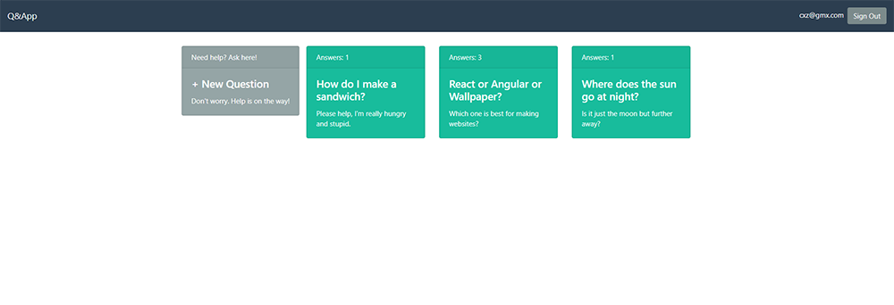

# Q&App

 
 
A React app backed with Node.js and Express. Based on the example at https://auth0.com/blog/react-tutorial-building-and-securing-your-first-app/
 
 
 

 
 
## Scripts
1. `cd scripts`
2. `./start_backend.sh`
3. In a second terminal: `./start_frontend.sh`
- Navigate to `http://localhost:3000/` to login to Q&App using Auth0.

